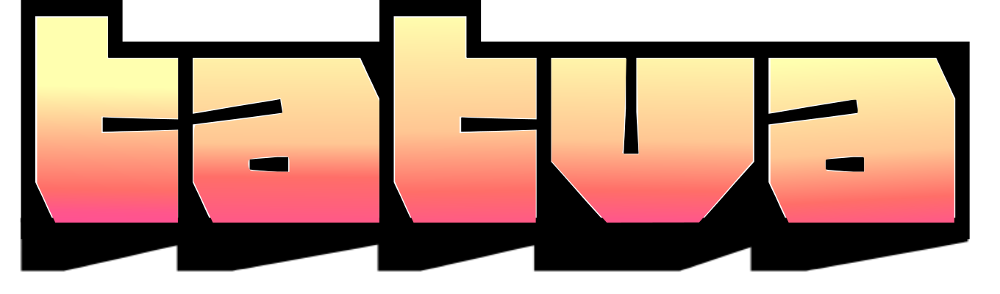

<div align="center">



<h3 align="center">Tatva (टत्तव) : Lego-like building blocks for FEM</h3>

`tatva` (is a Sanskrit word which means principle or elements of reality). True to its name, `tatva` provide fundamental Lego-like building blocks (elements) which can be used to construct complex finite element method (FEM) simulations. `tatva` is purely written in Python library for FEM simulations and is built on top of JAX and Equinox, making it easy to use FEM in a differentiable way.

</div>

## License

`tatva` is distributed under the GNU Lesser General Public License v3.0 or later. See `COPYING` and `COPYING.LESSER` for the complete terms. © 2025 ETH Zurich (Mohit Pundir).

## Features

- Element library covering line, surface, and volume primitives (Line2, Tri3, Quad4, Tet4, Hex8) with consistent JAX-compatible APIs.
- Mesh and Operator abstractions that map, integrate, differentiate, and interpolate fields on arbitrary meshes.
- Automatic handling of stacked multi-field variables through the `tatva.compound` utilities while preserving sparsity patterns.

## Installation

Install the current release from PyPI:

```bash
pip install tatva
```

For development work, clone the repository and install it in editable mode (use your preferred virtual environment tool such as `uv` or `venv`):

```bash
git clone https://gitlab.ethz.ch/smec/software/tatva.git
cd tatva
pip install -e .
```

## Usage

Create a mesh, pick an element type, and let `Operator` perform the heavy lifting with JAX arrays:

```python
import jax.numpy as jnp
from tatva.element import Tri3
from tatva.mesh import Mesh
from tatva.operator import Operator

coords = jnp.array([[0.0, 0.0], [1.0, 0.0], [1.0, 1.0], [0.0, 1.0]])
elements = jnp.array([[0, 1, 2], [0, 2, 3]])

mesh = Mesh(coords, elements)

op = Operator(mesh, Tri3())
nodal_values = jnp.arange(coords.shape[0], dtype=jnp.float64)

# Integrate a nodal field over the mesh
total = op.integrate(nodal_values)

# Evaluate gradients at all quadrature points
gradients = op.grad(nodal_values)
```

Examples for various applications will be added very soon. They showcase patterns such as
mapping custom kernels, working with compound fields, and sparse assembly helpers.

## Dense vs Sparse

A unique aspect of `femsolver` is that it can handle both dense and sparse matrices. This is achieved by using the library `sparsejac` that allows automatic differentiation of a functional based on a sparsity pattern. This significantly reduces the memory consumption. For more details on how the automatic differentiation can be done using sparsity pattern, please check the link below:

- 
- 
- 

## Contributing

If you have a suggestion that would make this better, please fork the repo and create a pull request. You can also simply open an issue with the tag "enhancement".
Don't forget to give the project a star! Thanks again!

1. Fork the Project
2. Create your Feature Branch (`git checkout -b feature/AmazingFeature`)
3. Commit your Changes (`git commit -m 'Add some AmazingFeature'`)
4. Push to the Branch (`git push origin feature/AmazingFeature`)
5. Open a Pull Request
